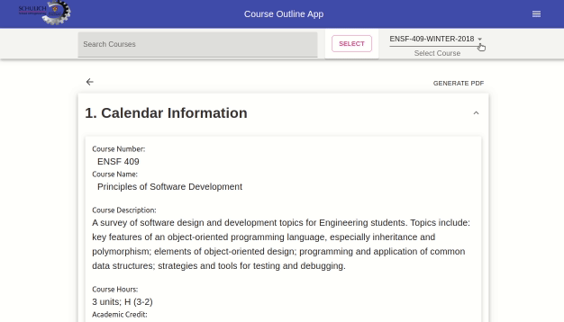
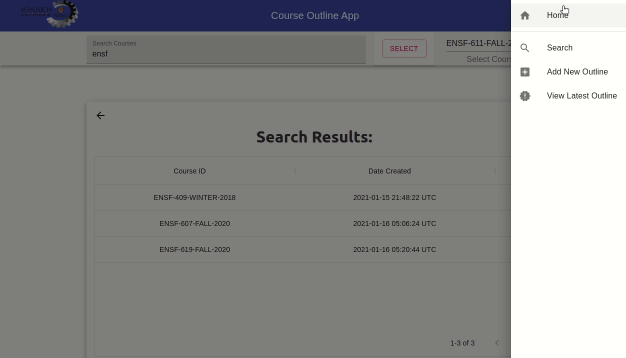
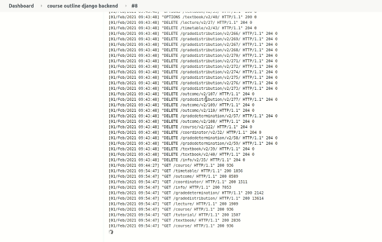

# Students:

- Ziad Chemali
- Lotfi Hasni
- Stan Chen


# Demo









# Screenshots


# Backend
## Installation

```
$ pip install -r requirements.txt
```

## Start Server

Run the following command inside the directory: todoapi/

python manage.py runserver

## migrate models

```
python manage.py makemigrations courseoutline
python manage.py migrate
```

## Jenkins build command

```
echo rebuilding ...
echo redeploying...
python CourseOutlineBackend/manage.py runserver 0:8000
echo execute shell reached...
```

