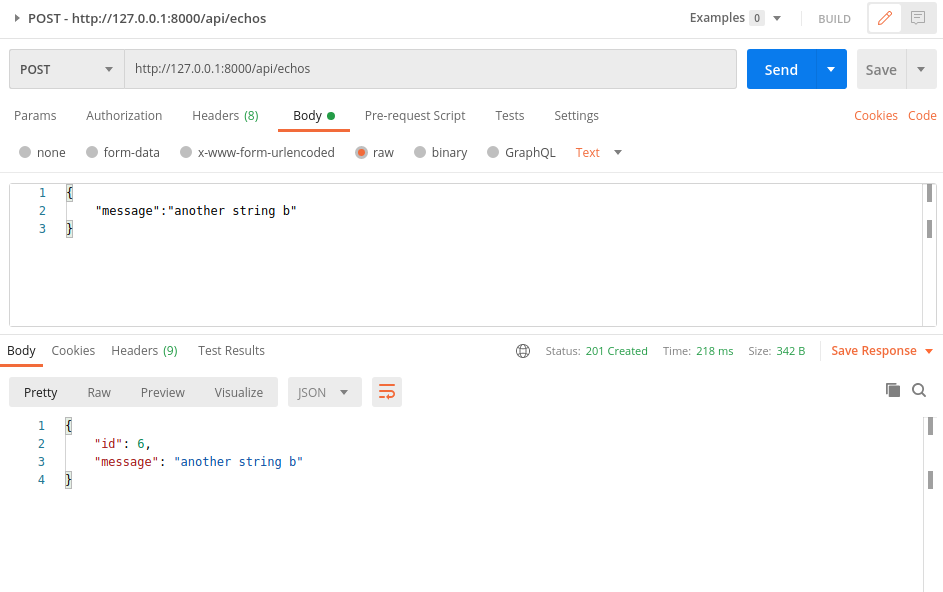
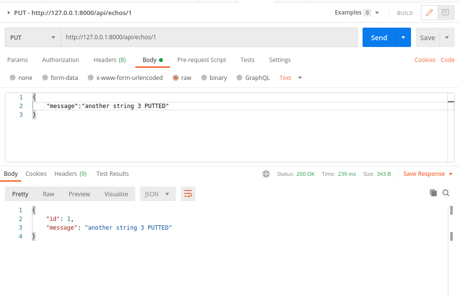

# Pre-Project Exercise on Django
Create a REST API with the following end point: 

http://localhost:8000/api/echos/.

`GET/api/echos`

Should list the link to all the echos

`POST/api/echos`
`body {“message”: “a string”}`
Should create an echo with the above information

`GET/api/echos/number (e.g GET/api/echos/1)`
Should show the echo information in json. (e.g “message”: “a string”)

`PUT/api/echos/number`
`body {“message”: “another string”}`
Should change the content of an existing echo

`DELETE/api/echos/number`
Should delete the content of an existing echo

[recommended reading](https://medium.com/swlh/build-your-first-rest-api-with-django-rest-framework-e394e39a482c)

### Commands

```
# To run server
python manage.py runserver
```

```
# create su
python manage.py createsuperuser
```

```
# migrate models
python manage.py makemigrations
python manage.py migrate
```

### Using Postman

##### GET


##### POST




##### PUT



